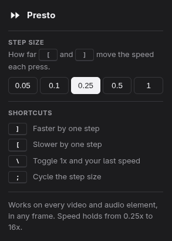

# Presto

Presto is playback speed control for every `<video>` and `<audio>` on the web,
not just YouTube. It works inside iframes, inside shadow DOM, and it holds your speed
through ad breaks, quality switches, and single-page navigation.


## Use it

A small control sits in the top-right corner of every video: `<<` to slow down,
the current speed, `>>` to speed up. Clicking the speed toggles back to 1x and
back again. It fades when you are not pointing at it.

| Key | Action |
|-----|--------|
| `]` | faster by one step |
| `[` | slower by one step |
| `\` | toggle between 1x and your last speed |
| `;` | change the step size |

The step defaults to 0.25. Set it from the toolbar popup, or cycle it with `;`
through 0.05, 0.1, 0.25, 0.5 and 1. Either way the choice is saved and follows
your browser profile. When it changes, the readout borrows itself for a moment
to show the new step as `±0.5` before returning to the speed.



The popup is also where the shortcuts are written down, so there is nothing to
memorise.

Speed ranges from 0.25x to 16x. Chrome mutes audio above roughly 4x, which is the
browser's behaviour, not this extension's.

## Install

Not on any extension store yet, so load it from source.

**Chrome, Edge, Brave** — open `chrome://extensions`, turn on Developer mode,
click *Load unpacked*, and select this folder.

**Firefox** — open `about:debugging#/runtime/this-firefox`, click
*Load Temporary Add-on*, and select `manifest.json`.

Content scripts only inject into pages loaded after the extension is installed,
so reload any tab you already had open.

## Browser support

Presto touches the DOM and one storage call. The `chrome.*` namespace it uses
is supported by Firefox as well, so the same unmodified source runs everywhere
and there is no polyfill layer.

| Browser | Status |
|---------|--------|
| Chrome, Edge, Brave, and other Chromium browsers | Supported |
| Firefox 142 and later | Supported |
| Firefox for Android 142 and later | Expected to work, untested |
| Safari | Needs separate packaging, not attempted |

The Firefox floor is 142 because that is when Firefox for Android started
accepting the data collection consent key. The code itself only needs Firefox
127, which is when manifest-declared content script host permissions began being
granted at install. Below that, Presto would install but never run.

Presto collects and transmits nothing, declared in the manifest as
`data_collection_permissions: { required: ["none"] }`. It has no background
worker and makes no network calls. Its one permission is `storage`, used to
remember your step size and nothing else.

## How it works

Three problems make a naive speed controller feel broken, and each one is
handled in `src/content.js`.

**Players reset the rate behind your back.** Adaptive players reassign
`playbackRate` on quality switches, ad transitions, and source changes. Every
media element gets a guarded `ratechange` listener that re-asserts your speed.

**Every frame is an island.** Each frame on a page runs its own isolated copy of
the content script, so a key pressed in the top frame cannot reach a video in an
embedded player, and a key pressed while an embedded player has focus cannot
reach anything else. All speed changes are relayed to the top frame, which owns
the speed and broadcasts it down the whole frame tree. No frame applies a speed
on its own.

**Sites bind the same keys.** The key listener runs on `window` in the capture
phase and stops propagation, so it wins against players that bind their own
shortcuts. It bails out when you are typing in a field.

The control is positioned over each video rather than inserted into the player's
own markup, which keeps it from breaking sites that rebuild their controls.

## Layout

Three kinds of thing live here, and nothing belongs to two of them.

**Ships to the browser.** This is the whole extension, and exactly what
`web-ext build` puts in the zip.

```
manifest.json          must sit at the repository root
src/steps.js           the step sizes, shared by the content script and popup
src/content.js         everything that happens on the page
src/popup.html         the toolbar panel
src/popup.css
src/popup.js
icons/icon16.png       and 32, 48, 128
LICENSE
```

**Testing.** Never shipped.

```
test/unit.js           node test/unit.js, the speed and step arithmetic
test/page.html         manual harness: iframes, shadow DOM, late-added video
test/clip.mp4          a 20 second clip with a visible frame counter
```

**Development and publishing.** Never shipped.

```
README.md
CHANGELOG.md           what changed in each released version
SECURITY.md            how to report a vulnerability privately
icons/icon.svg         the source the four PNGs are rasterized from
docs/screenshot.png    the images above
docs/popup.png
docs/amo-listing.md    paste-ready copy for the add-on store
web-ext-config.cjs     says which files stay out of the package
.github/workflows/     runs the tests on every push
dist/                  build output, git ignored
```

There is no build step. The files in `src/` are the files the browser runs, so
there is nothing to compile, bundle, or minify, and no `package.json`.

There is no background service worker either. The popup and the content script
talk to each other through extension storage, which both can reach directly, and
nothing has to run when no page is open. A service worker would only be needed
to register shortcuts through the `commands` API, so they could be rebound in
the browser's own shortcuts page.

## Develop

```sh
node test/unit.js                        # unit tests
python3 -m http.server -d test 8000      # then open http://localhost:8000/page.html
```

Serve the test page over http rather than opening the file directly, or Chrome
will make you grant file-URL access separately.

Reloading the page is not enough to pick up an edit to `src/content.js`. Chrome
keeps serving the previously loaded copy to new pages, so reload the extension
itself at `chrome://extensions` after every change, then reload the page.

The test page covers the cases that are easy to get wrong: a plain video, one
inside a shadow root, one inside an iframe, typing in a text field, and a video
added after load. For the ad-break and quality-switch behaviour, use a real site.

`test/unit.js` extracts the speed function out of `src/content.js` rather than restating
it, so changing the step or the clamp fails the test.

### Running it in a browser

`web-ext` installs the extension into a throwaway profile and, unlike loading it
by hand, reloads it whenever a source file changes:

```sh
npx web-ext run                                  # Firefox
npx web-ext run -t chromium                      # Chrome
npx web-ext run -u http://localhost:8000/page.html   # open the test page too
```

The profile is temporary, so the extension disappears when you close the
browser, and your normal profile is untouched.

To load it by hand in Firefox instead, open `about:debugging#/runtime/this-firefox`,
click *Load Temporary Add-on*, and select `manifest.json`. The add-on lasts until
you close Firefox, and you must click *Reload* there after every source change.

### Checks

Mozilla's linter checks the manifest and the source against add-on policy, and
should stay clean:

```sh
npx web-ext lint --self-hosted     # expect zero errors and zero warnings
npx web-ext build                  # zip for distribution, dev files excluded
```

The test clip and the icons are committed, and regenerated with:

```sh
ffmpeg -f lavfi -i testsrc=size=320x240:rate=30 -t 20 -pix_fmt yuv420p test/clip.mp4
for s in 16 32 48 128; do rsvg-convert -w $s -h $s icons/icon.svg -o icons/icon$s.png; done
```

## Publishing to Firefox

The extension id in the manifest is permanent once Mozilla accepts a
submission. Changing it later creates a different add-on that existing users
never receive. It must also be globally unique across every add-on ever
submitted, so namespace it to a domain or account you control rather than
picking something generic.

```sh
npx web-ext build                  # writes dist/presto_video_speed_control-<version>.zip
```

Upload that zip at [addons.mozilla.org](https://addons.mozilla.org/developers/addon/submit/distribution).
Two-factor authentication is required on the account. Choose *On this site* to
list it publicly, or *On your own* to get a signed copy you distribute yourself.
No source code upload is needed, since nothing here is minified or bundled.

Bump `version` in `manifest.json` for every submission and add a section to
`CHANGELOG.md`. Mozilla rejects a version number it has already seen.

## Contributing

Issues and pull requests are welcome. Keep `src/content.js` dependency-free and a
single file. If you change behaviour, add a case to `test/unit.js` when it is
testable without a browser, or to `test/page.html` when it is not, and say in
the pull request which sites you checked it against.

## License

MIT, see [LICENSE](LICENSE).
